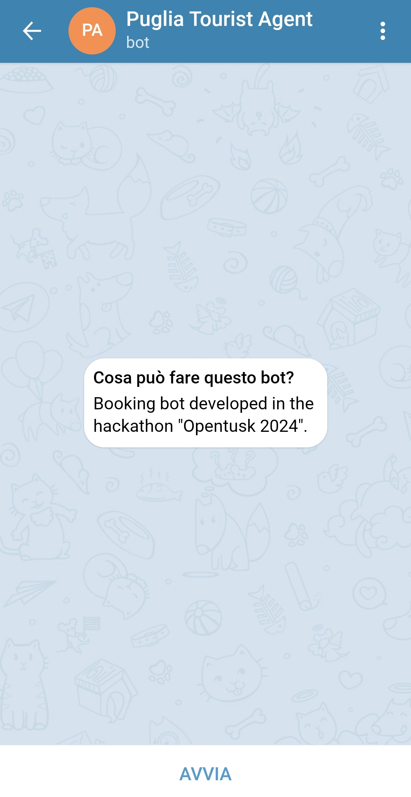
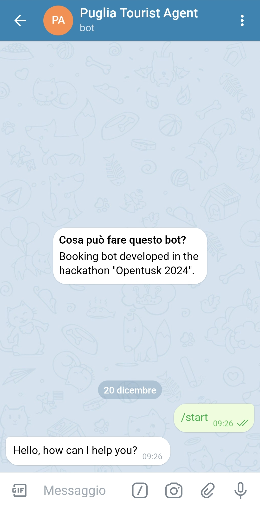
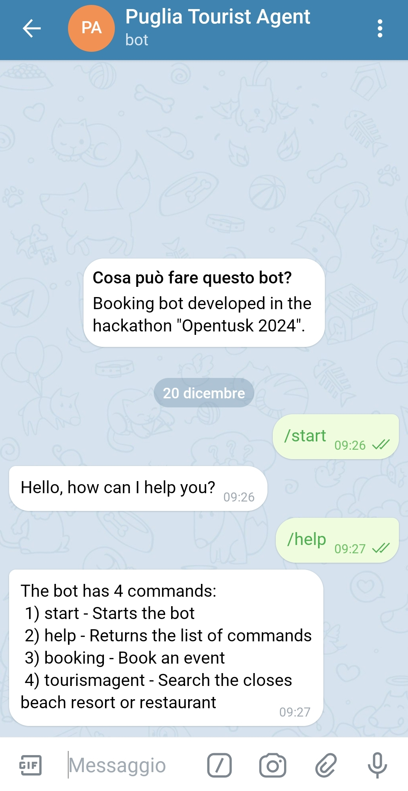
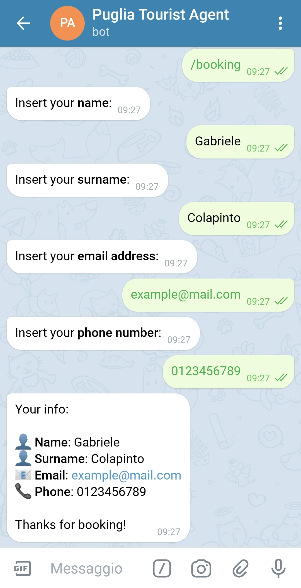
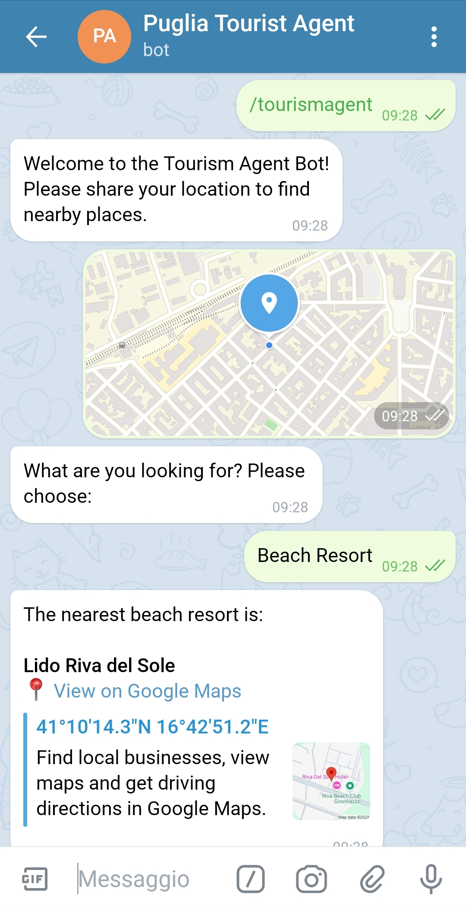
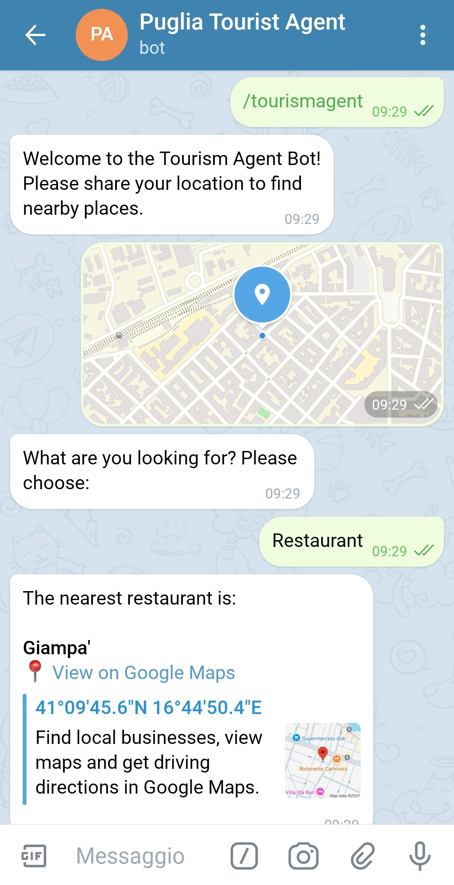

# Puglia Tourist Agent
Puglia Tourist Agent is a Telegram booking bot developed during the hackathon [Opentusk 2024](https://dati.puglia.it/web/guest/hackathon-opentusk-2024).
The purpose of this bot is to make booking easier for tourists visiting our beautiful region.

## The bot
You can find the bot at the following URL: [Puglia Tourist Agent](https://t.me/Prenotazioni_opentusk_2024_bot)

The bot will not respond to your commands because it runs locally but if we decide to implement the project it will be managed by a remote server.

This is what you see when you visit the bot:

You can start the bot and use the following commands:

### Start
This is the command that starts the bot.

### Help
This command returns the list of commands the bot can execute.

### Booking
This command asks for user info to book an event or a service. For now the bot does not communicate to an external website but if we decide to develop the project it will allow you to do so.

### Tourist agent
This command allows the user to search for the closest beach resort or restaurant.
To do so you need to activate the GPS and provide the bot your location.

**Find the closest beach resort**

**Find the closest restaurant**

## Folder content
The folder contains:
- 'data' folder: The folder containing the csv datasets used by the bot. These datasets were taken from the [Open data repository](https://dati.puglia.it/) of our splendid region ❤.
- 'images' folder: The folder containing the images shown in this document.
- 'data_management.py': Python file containing the functions to manage the data used by the bot.
- 'main.py': Python file containing the functions to implement the commands and run the bot.
- The presentation of the project.
- 'readme.md': The file you are reading right now.
- 'requirements.txt': The packages required to run the bot in its virtual environment. (The project is made using Python 3.11)

## Useful links
- [Website of the project](https://vincenzobelpiede.com/puglia-tourist-agent)
- [Video of the presentation](https://www.youtube.com/watch?v=WE2usl0Bc98)
